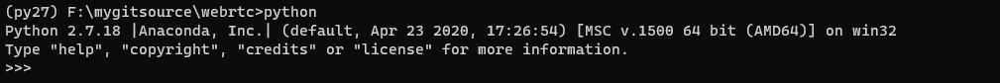

**WebRTC is a free, open software project** that provides browsers and mobile
applications with Real-Time Communications (RTC) capabilities via simple APIs.
The WebRTC components have been optimized to best serve this purpose.

**Our mission:** To enable rich, high-quality RTC applications to be
developed for the browser, mobile platforms, and IoT devices, and allow them
all to communicate via a common set of protocols.

The WebRTC initiative is a project supported by Google, Mozilla and Opera,
amongst others. This page is maintained by the Google Chrome team.

### Development

See http://www.webrtc.org/native-code/development for instructions on how to get
started developing with the native code.

### More info

 * Official web site: http://www.webrtc.org
 * Master source code repo: https://chromium.googlesource.com/external/webrtc
 * Samples and reference apps: https://github.com/webrtc
 * Mailing list: http://groups.google.com/group/discuss-webrtc
 * Continuous build: http://build.chromium.org/p/client.webrtc

### 编译方法
1.编译时会调用python脚本生成一些文件，保证环境变量中有python2

2.用vs打开all.sln项目编译即可